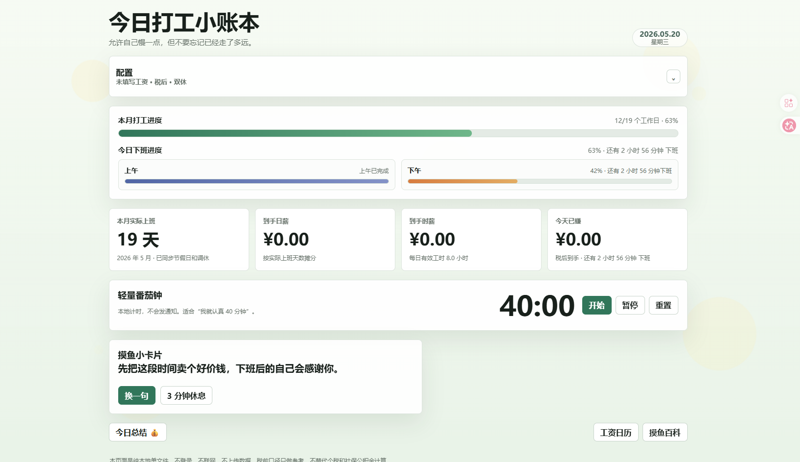

# 今日打工小账本

一个本地优先的工资与工作进度仪表盘，用于计算月工作日、日薪、时薪、今日已赚金额，并提供工资日历、今日状态记录和轻量摸鱼组件。



在线预览：

[https://shannonn-ssc.github.io/shannon-s-salary-dashboard/](https://shannonn-ssc.github.io/shannon-s-salary-dashboard/)

## 最近更新

- 新增收入档案页，用于记录工作段、税前收入、五险一金个人/单位缴费。
- 支持按社保基数和公积金基数自动速算缴费金额，也可以手动覆盖。
- 新增退休档案与退休金估算，区分个人账户养老金和单位统筹缴费。
- 新增全局数据备份，可导出/导入工资配置、心情记录、收入档案和节假日缓存。
- 优化主页入口卡片、番茄钟、摸鱼小卡片和配置区布局。

## 功能

- 按月工资、税前/税后口径、工作方式计算日薪和时薪。
- 支持双休、单休，并结合中国法定节假日与调休数据计算实际工作日。
- 实时展示今日已赚金额、本月工作进度、上午/下午下班进度。
- 支持上班时间、下班时间、午休时间配置。
- 提供工资日历，按日期展示工作日、休息日、调休和每日金额。
- 支持今日状态记录，并在日历中以 emoji 展示。
- 提供收入档案，记录税前收入、五险一金缴纳、个人/单位累计缴费和退休估算。
- 内置随机摸鱼卡片、40 分钟番茄钟、摸鱼百科入口和全局数据备份。

## 页面结构

```text
.
├── index.html      # 主仪表盘
├── calendar.html   # 工资日历
├── income.html     # 收入档案与退休估算
├── moyu.html       # 摸鱼百科
└── assets/
    └── dashboard-screenshot.png
```

## 使用方式

直接访问 GitHub Pages：

[https://shannonn-ssc.github.io/shannon-s-salary-dashboard/](https://shannonn-ssc.github.io/shannon-s-salary-dashboard/)

或下载仓库后本地打开：

```text
index.html
```

该项目是纯静态页面，不需要构建步骤，也不依赖后端服务。

## 数据说明

配置数据保存在浏览器 `localStorage` 中，包括工资、作息、今日状态记录和收入档案。仓库本身不包含个人工资数据。

主页提供全局数据备份功能，可以将本地数据导出为 JSON 文件，也可以在同一浏览器或其他设备上导入恢复。

节假日与调休数据来自开源日历数据源，加载失败时会回退到普通周历规则。

## 备注

主页的税前工资仍仅作为参考口径展示，未内置个税和专项扣除计算。收入档案页提供五险一金缴费速算和退休金估算，结果仅供个人记录与参考，不替代社保部门核定。
